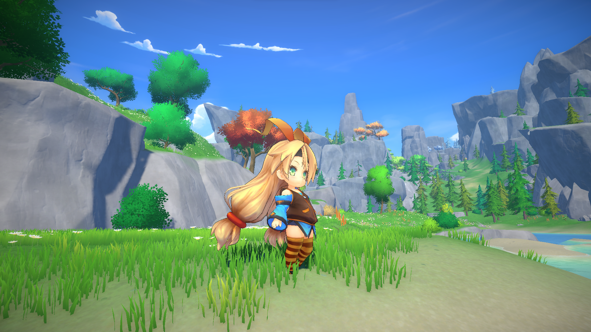

# 썸네일

# 사용한 에셋 및 라이선스(License)
아래 에셋들은 [Unity Asset Store](https://assetstore.unity.com/)에서 배포되며, [Unity Asset Store Terms of Service and EULA](https://unity.com/legal/as-terms)에 따라 라이선스가 적용됩니다.
- [Stylized Nature & Environment MEGA PACK](https://assetstore.unity.com/packages/3d/environments/stylized-nature-environment-mega-pack-326646) - by [So Stylized](https://assetstore.unity.com/publishers/113914)
- [RPG Monster Couple PBR Polyart](https://assetstore.unity.com/packages/3d/characters/creatures/rpg-monster-couple-pbr-polyart-355988) - by [Dungeon Mason](https://assetstore.unity.com/publishers/23554)
- [RPG Monster Buddy PBR Polyart](https://assetstore.unity.com/packages/3d/characters/creatures/rpg-monster-buddy-pbr-polyart-253961) - by [Dungeon Mason](https://assetstore.unity.com/publishers/23554)
- [RPG Monster Partners PBR Polyart](https://assetstore.unity.com/packages/3d/characters/creatures/rpg-monster-partners-pbr-polyart-168251) - by [Dungeon Mason](https://assetstore.unity.com/publishers/23554)
- [RPG Monster Duo PBR Polyart](https://assetstore.unity.com/packages/3d/characters/creatures/rpg-monster-duo-pbr-polyart-157762) - by [Dungeon Mason](https://assetstore.unity.com/publishers/23554)
- [Party Monster Duo Polyart PBR](https://assetstore.unity.com/packages/3d/characters/creatures/party-monster-duo-polyart-pbr-195698) - by [Dungeon Mason](https://assetstore.unity.com/publishers/23554)
- [Monster Minion Survivor PBR Polyart](https://assetstore.unity.com/packages/3d/characters/creatures/monster-minion-survivor-pbr-polyart-269515) - by [Dungeon Mason](https://assetstore.unity.com/publishers/23554)

아래 에셋은 [Unity-chan License](https://unity3d.jp/unity-chan_contents/license.php?lang=en)가 적용됩니다.
- [SD Unity-chan 3D model data](https://unity3d.jp/unity-chan_contents/releaseNote.php?id=SDUnityChan&lang=en) - by [Unity Technologies Japan](https://github.com/unity3d-jp)

아래 에셋은 [Creative Commons CC0](/License/License.txt)라이선스가 적용됩니다.
- [Input Prompts](https://kenney.nl/assets/input-prompts) - by [Kenny](https://www.patreon.com/cw/kenney)